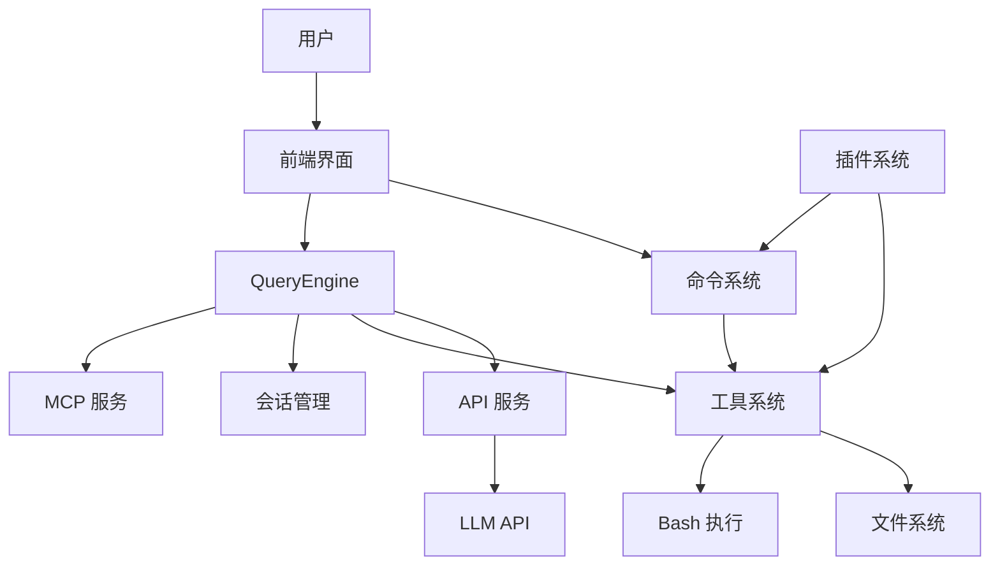
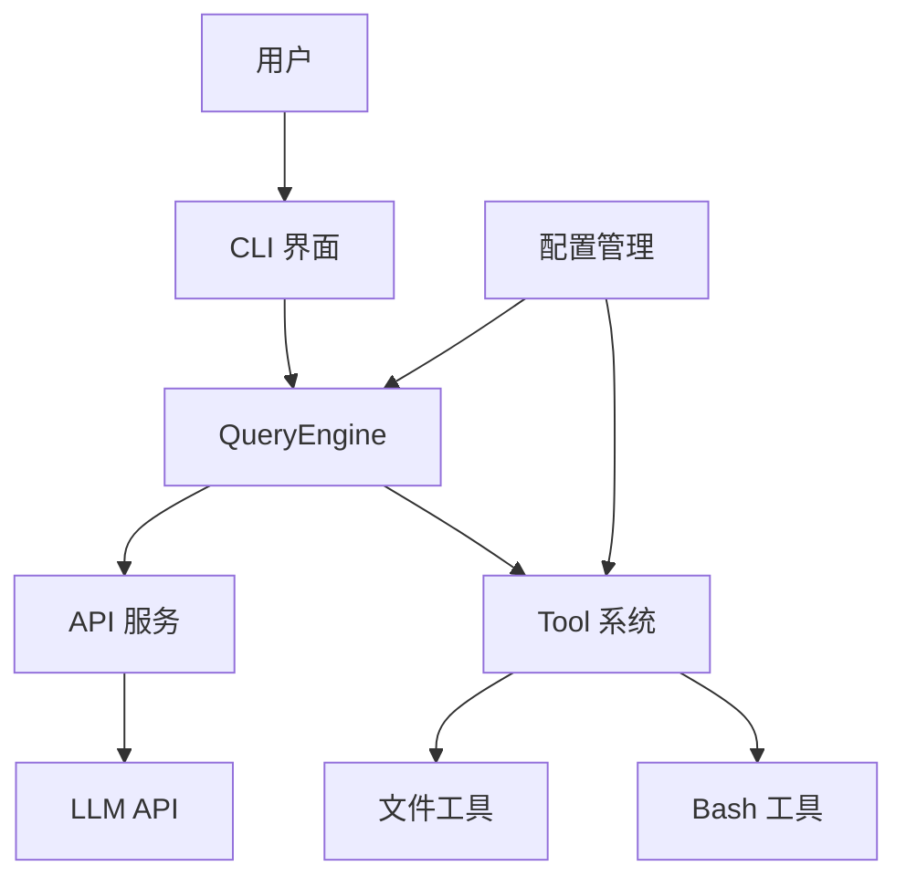

# Claude Code 项目架构设计说明书

## 1. 项目概述

Claude Code 是一个基于 AI 助手的代码开发工具，提供了丰富的功能和工具，帮助开发者更高效地进行代码开发、分析和管理。项目采用 TypeScript 开发，使用 React 和 Ink 构建终端用户界面，集成了多种服务和工具系统。

### 1.1 核心功能

- AI 代码助手功能
- 命令行界面和交互体验
- 工具系统（文件操作、Bash 执行、代码分析等）
- 会话管理和历史记录
- 插件和技能系统
- MCP（Model Context Protocol）集成
- 多平台支持（macOS、Windows、Linux）

## 2. 架构设计

### 2.1 整体架构

Claude Code 采用分层架构设计，主要包括：

1. **核心层**：包含 QueryEngine、Tool 系统和命令系统
2. **服务层**：提供 API 调用、MCP 集成、分析等服务
3. **界面层**：基于 React/Ink 的终端用户界面
4. **工具层**：各种内置工具和插件
5. **基础设施层**：配置管理、安全存储、文件系统等

### 2.2 核心模块

#### 2.2.1 QueryEngine

QueryEngine 是项目的核心引擎，负责处理 LLM API 调用、会话管理和工具调用循环。

- **功能**：
  - 管理对话的查询生命周期和会话状态
  - 处理流式响应和工具调用循环
  - 实现思考模式、重试逻辑和令牌计数
  - 管理会话历史和状态持久化

- **关键组件**：
  - `submitMessage()`：处理用户输入并启动查询
  - `processUserInput()`：处理用户输入和命令
  - 会话状态管理：消息、文件缓存、使用情况等

#### 2.2.2 Tool 系统

Tool 系统定义了工具的基础类型和接口，支持各种工具的注册和执行。

- **功能**：
  - 定义工具的输入模式和权限模型
  - 提供工具调用的上下文和进度状态
  - 支持工具的渲染和结果处理

- **关键组件**：
  - `Tool` 类型：定义工具的接口和方法
  - 工具权限检查和验证
  - 工具结果渲染和处理

#### 2.2.3 命令系统

命令系统管理所有斜杠命令的注册和执行。

- **功能**：
  - 注册和管理所有命令
  - 处理命令的执行和参数解析
  - 支持条件导入和环境特定命令

- **关键组件**：
  - `getCommands()`：获取可用命令列表
  - 命令分类：Prompt 命令、Local 命令、LocalJSX 命令
  - 动态技能发现和加载

#### 2.2.4 前端界面

基于 React/Ink 的终端用户界面，提供交互式体验。

- **功能**：
  - 渲染消息和工具结果
  - 处理用户输入和键盘事件
  - 提供命令行界面和交互元素

- **关键组件**：
  - `App.tsx`：主应用组件
  - `Message.tsx`：消息渲染组件
  - `TextInput.tsx`：文本输入组件

### 2.3 数据流

1. **用户输入流**：
   - 用户输入 → TextInput 组件 → processUserInput → 命令处理/工具调用

2. **查询处理流**：
   - 用户输入 → QueryEngine.submitMessage → API 调用 → 流式响应 → 工具调用循环 → 结果渲染

3. **工具调用流**：
   - LLM 生成工具调用 → 权限检查 → 工具执行 → 结果处理 → 继续查询循环

4. **会话管理流**：
   - 会话创建 → 消息积累 → 历史记录保存 → 会话恢复

### 2.4 组件关系

## 3. 核心功能模块

### 3.1 QueryEngine

QueryEngine 是整个系统的核心，负责管理查询生命周期和会话状态。

- **会话管理**：
  - 维护会话消息历史
  - 处理会话状态持久化
  - 支持会话恢复和继续

- **查询处理**：
  - 构建系统提示和上下文
  - 调用 LLM API 并处理响应
  - 管理工具调用循环
  - 处理错误和重试逻辑

- **状态管理**：
  - 跟踪 API 使用情况和成本
  - 管理文件缓存和状态
  - 处理权限和安全检查

### 3.2 Tool 系统

Tool 系统提供了一种标准化的方式来定义和执行各种工具。

- **工具类型**：
  - 文件操作工具（Read、Write、Edit）
  - Bash 执行工具
  - 代码分析工具
  - MCP 工具
  - 技能工具

- **工具接口**：
  - `call()`：执行工具逻辑
  - `description()`：生成工具描述
  - `validateInput()`：验证输入参数
  - `checkPermissions()`：检查权限
  - `renderToolResultMessage()`：渲染工具结果

- **权限系统**：
  - 基于输入的权限检查
  - 自动模式和手动模式
  - 权限缓存和决策记录

### 3.3 命令系统

命令系统管理所有斜杠命令的注册和执行。

- **命令类型**：
  - Prompt 命令：生成提示并获取 LLM 响应
  - Local 命令：在本地执行操作
  - LocalJSX 命令：执行并渲染 JSX 组件

- **命令发现**：
  - 内置命令注册
  - 插件命令加载
  - 动态技能发现

- **命令执行**：
  - 参数解析和验证
  - 命令执行和结果处理
  - 错误处理和用户反馈

### 3.4 前端界面

基于 React/Ink 的终端用户界面，提供交互式体验。

- **界面组件**：
  - 消息列表和渲染
  - 文本输入和自动完成
  - 命令行提示和帮助
  - 工具结果可视化

- **交互功能**：
  - 键盘快捷键和命令
  - 文本选择和复制
  - 会话管理和导航
  - 主题和样式定制

- **性能优化**：
  - 虚拟滚动和渲染优化
  - 异步加载和处理
  - 终端大小适配

## 4. 服务层

### 4.1 API 服务

处理与 LLM API 的通信和管理。

- **功能**：
  - API 调用和响应处理
  - 错误处理和重试逻辑
  - 使用情况跟踪和成本计算
  - 会话管理和上下文构建

- **集成**：
  - Anthropic API
  - AWS Bedrock
  - Google Vertex AI
  - 其他 LLM 提供商

### 4.2 MCP 服务

管理 Model Context Protocol 集成，支持外部工具和服务。

- **功能**：
  - MCP 服务器连接和管理
  - 工具发现和注册
  - 权限管理和验证
  - 资源管理和缓存

- **集成**：
  - 官方 MCP 服务器
  - 自定义 MCP 服务器
  - Claude AI MCP 配置

### 4.3 分析服务

提供使用情况分析和遥测。

- **功能**：
  - 事件跟踪和记录
  - 使用情况统计和报告
  - 性能监控和分析
  - 功能标志管理

- **工具**：
  - GrowthBook：功能标志和实验
  - 自定义遥测系统
  - 性能分析工具

## 5. 启动优化策略

Claude Code 采用了多种启动优化策略，以提高启动速度和用户体验。

### 5.1 并行预取

- **MDM 读取**：启动 MDM 子进程并行运行
- **钥匙串预取**：并行读取 macOS 钥匙串
- **配置加载**：并行加载配置和设置

### 5.2 延迟加载

- **条件导入**：基于功能标志的条件导入
- **死代码消除**：使用 Bun bundle 进行死代码消除
- **懒加载**：重型模块的延迟加载

### 5.3 缓存策略

- **模块缓存**：缓存常用模块和依赖
- **技能缓存**：缓存技能和插件
- **会话缓存**：缓存会话状态和历史

## 6. 缺失模块和优化空间

### 6.1 缺失模块

1. **测试框架**：缺乏完整的测试覆盖
2. **文档系统**：缺乏详细的开发文档
3. **国际化支持**：缺乏多语言支持
4. **容器化部署**：缺乏 Docker 部署方案
5. **CI/CD 流程**：缺乏自动化构建和部署流程

### 6.2 优化空间

1. **性能优化**：
   - 减少启动时间
   - 优化内存使用
   - 提高渲染性能

2. **安全性**：
   - 加强权限管理
   - 改进安全检查
   - 增强数据保护

3. **可扩展性**：
   - 改进插件系统
   - 增强技能发现
   - 支持更多 LLM 提供商

4. **用户体验**：
   - 改进错误处理
   - 增强命令提示
   - 优化工具结果展示

## 7. POC 项目设计

### 7.1 设计理念

基于 Claude Code 的核心设计理念，构建一个小型版本的 POC 项目，包含以下核心功能：

- 简化的 QueryEngine 实现
- 基础的工具系统
- 命令行界面
- 基本的 API 集成
- Docker 部署支持

### 7.2 架构设计

### 7.3 核心组件

1. **QueryEngine**：
   - 简化的查询处理
   - 基本的会话管理
   - API 调用和响应处理

2. **Tool 系统**：
   - 基础工具类型
   - 文件操作工具
   - Bash 执行工具

3. **CLI 界面**：
   - 命令行解析
   - 消息渲染
   - 用户输入处理

4. **API 服务**：
   - LLM API 集成
   - 错误处理
   - 使用情况跟踪

5. **配置管理**：
   - 环境变量配置
   - 用户设置
   - API 密钥管理

## 8. 部署方案

### 8.1 Docker 配置

- **Dockerfile**：定义容器构建
- **docker-compose.yml**：配置服务栈
- **环境变量**：配置 API 密钥和设置

### 8.2 服务栈

- **后端**：Node.js 服务
- **前端**：命令行界面
- **存储**：本地文件系统
- **网络**：API 调用和外部服务

### 8.3 部署步骤

1. **构建容器**：`docker build -t claude-code-poc .`
2. **运行容器**：`docker run -it claude-code-poc`
3. **配置 API 密钥**：设置环境变量
4. **启动服务**：初始化并运行 POC 项目

## 9. 技术栈

### 9.1 核心技术

- **TypeScript**：类型安全的 JavaScript 超集
- **React**：UI 组件库
- **Ink**：React 终端渲染库
- **Bun**：现代 JavaScript 运行时
- **Commander.js**：命令行解析

### 9.2 依赖库

- **@anthropic-ai/sdk**：Anthropic API 客户端
- **lodash-es**：实用工具库
- **zod**：模式验证
- **chalk**：终端颜色
- **axios**：HTTP 客户端

### 9.3 服务集成

- **Anthropic API**：LLM 服务
- **AWS Bedrock**：云 LLM 服务
- **Google Vertex AI**：云 LLM 服务
- **MCP**：Model Context Protocol

## 10. 总结

Claude Code 是一个功能丰富的 AI 代码助手工具，采用模块化、分层的架构设计。核心模块包括 QueryEngine、Tool 系统、命令系统和前端界面，通过服务层与外部 API 和服务集成。

POC 项目基于核心设计理念，构建了一个简化版本，包含基本的查询处理、工具系统和命令行界面，并支持 Docker 部署。

未来的优化方向包括性能提升、安全性增强、可扩展性改进和用户体验优化，以构建一个更强大、更可靠的 AI 代码助手工具。